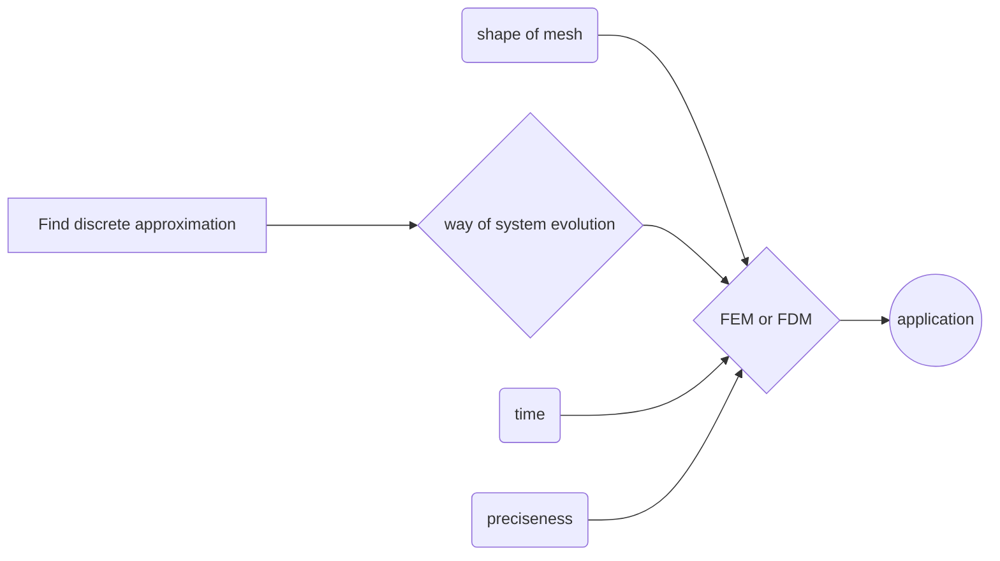

# ComputationalGeophysics
Hereby I present my work on the results of the _Computational Geophysics_ course. 
> these scripts were my first serious python projects, so they are a bit noobie :)

## Summary 
During the course three main themes were discussed: 
  1. **numerical approximations** for derivatives, integrals, and solving systems of linear equations;
  2. **evolution approaches** to solve and compute a system evolution (explicit, implicit, central);
  3. **FDM** (Finite Difference Method) and **FEM** (Finite Element Method) for 1D and 2D systems.
 
In a nutshell, 
  - central approach works more precise and less explosive (the Gauss-Seidel or the Crank-Nicolson), 
  - for integrals, Gaussian quadrature is faster and more accurate, 
  - smaller steps improve performance and workability,
  - FDM is faster, yet less stable and accurate in comparison to FEM. Also, FEM works for non-Cartesian grids too.
For more information and discussion, please, **find the final report** attached.

## Content
All codes are subdivided into several categories:
  - numerical approximations
  - 1D diffution and advection
  - 2D diffution and advection
  - final project 
  
This structure is chosen as a natural progression and assembly of previous attempts:

